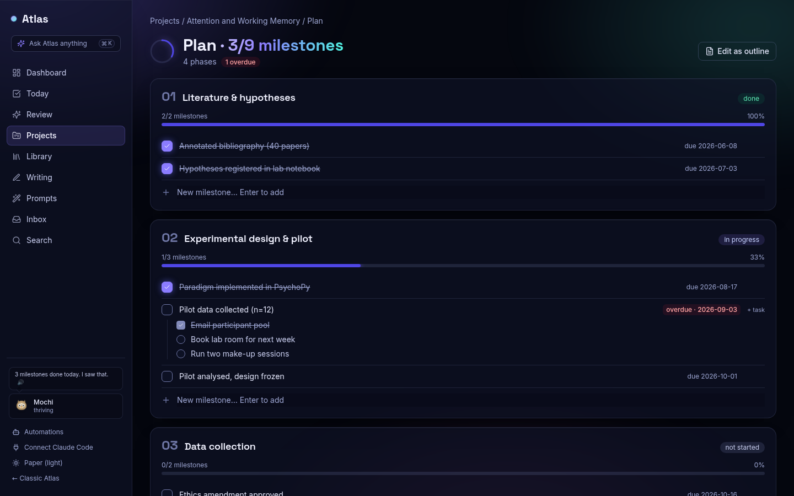

# Atlas 🗺️ — the self-hosted research workbench


**Plans, papers, notes, and manuscripts in one calm place — with an AI collaborator built in.**

Atlas is a single-user, self-hosted platform for researchers who find Jira-style tools noisy
and task-obsessed. It treats the things researchers actually care about as first-class:
project **plans** (phases → milestones), a **reference library** with one-click DOI import,
**linked notes** with a 3D knowledge graph, a **writing studio** that compiles LaTeX, and an
**MCP server** so Claude can work inside your research base — list projects, check off
milestones, add papers, fetch your saved prompts.

> Built like Django itself: boring technology, strong conventions, everything has exactly
> one obvious place. No SPA, no Node build, no cloud, no telemetry.

| | |
|---|---|
|  |  |
|  |  |
| *The Observatory dashboard: a living constellation of your projects and what needs you today* | *The Library workbench: drop PDFs/BibTeX/RIS or pull Zotero, facet by year/venue/project, bulk-file, recover metadata* |
|  |  |
| *Discover from any paper: similar / cites / cited-by on OpenAlex, one-click add into a project* | *3D citation + notes graph, synced from OpenAlex* |
|  |  |
| *One-glance project overview with a tree that grows with progress* | *LaTeX editor: cite-key autocomplete, Tectonic compile, live PDF preview* |
|  |  |
| *In-browser PDF reader with highlight-to-note and page comments* | *Bulk bar: link, mark as read, export .bib, fetch OA PDFs, recover metadata* |

## What's inside

- **Plans, not backlogs** — phases → milestones → optional tasks; progress rolls up visually; overdue is loud, everything else is calm; **write the plan as a document** — the whole plan round-trips through a Markdown outline (`# phase [status] (start → end)`, `> objective`, `- [ ] milestone (due …)`, indented tasks) with a live preview of what a save creates, renames and deletes; Claude edits the same outline through MCP; inline quick-add for milestones and tasks, click-to-cycle phase status
- **Library workbench** — add by DOI/arXiv (Crossref/OpenAlex metadata); **import from anywhere**: drop a folder of PDFs onto the page (the DOI is read off page one and metadata fetched; scans without one are kept and can "find metadata" later), BibTeX, RIS, CSL-JSON, or pull your whole **Zotero** library in one click — all deduplicated; facets by project, year histogram, venue, type, PDF; keyboard `j/k/x/o`; bulk file-to-project, reading status, delete; BibTeX export, reading queue, auto-download of open-access PDFs, duplicate/retraction checkers; **read and highlight without leaving the workbench** — a pdf.js reader takes over the centre pane, selecting text saves a coloured highlight (structured rows with page + comment, mirrored into the project's highlights note), highlights paint back onto the page, copy them all as Markdown; per-project **reading notes** autosave in the detail pane; **Find PDF** per paper (arXiv → Unpaywall); **search inside your PDFs** — every attached PDF is read into searchable text, so the search box, the global search and Claude find papers by what they say, with the page and a snippet, and the reader jumps to it
- **Duplicate merge** — the Library spots the same paper imported twice (DOI, arXiv id, near-identical title) and merges them in one click, keeping the most complete record and moving every link, tag, note, and PDF
- **Tags & smart views** — label papers (bulk or one at a time), filter by tag in the rail, and save any filter combination as a named view that is one click away
- **Formatted citations** — copy any paper or selection as APA 7, MLA 9, Chicago, Harvard, Vancouver, or IEEE (bibliography entry and in-text form) straight from the Library
- **Discover from any paper** — three OpenAlex lenses in the Library (similar work, what it cites, what cites it), each row addable in one click into the library or the current project; export any selection or filtered view as `.bib`, copy BibTeX, fetch open-access PDFs in bulk
- **Literature review matrix** — papers × themes grid with markdown export
- **Notes & knowledge graph** — `[[wiki-links]]`, backlinks, typo-tolerant full-text search, related-paper suggestions (local TF-IDF, no API calls)
- **Writing studio** — manuscript pipeline (idea → published), cite checker against your `.tex`, **server-side LaTeX compilation** (vendored Tectonic) with split-view preview
- **Research tools** — hypothesis ledger with evidence balance, experiment log, dataset registry, decision log
- **Automations** — deadline-reminder, retraction-watch, and citation-sync bots reporting to your inbox
- **Local extras** — Piper text-to-speech ("read this abstract to me"), extractive tl;dr, keyword tag suggestions — all offline
- **Claude/MCP integration** — 59 tools over the REST API; your AI assistant operates the same contract you do
- **Today list** — a dead-simple personal to-do list for the day (add, tick, clear done); nothing is lost overnight; Claude can add to it
- **A pet owl** 🦉 — fed by finished research; never nags; sleeps when you rest

## Quick start (one command)

With just Docker installed:

```bash
git clone <repo-url> atlas && cd atlas
cp .env.example .env                       # set SECRET_KEY, ATLAS_API_KEY, DEBUG=false
docker compose --profile app up -d --build
docker compose exec web .venv/bin/python manage.py createsuperuser
```

Atlas is on http://127.0.0.1:8000 — the React app is the front door (the classic
server-rendered UI remains at /classic/ and trailing-slash URLs); web app, background
worker, Postgres, and Redis all running.

## Quick start (development)

Prerequisites: Python 3.12+, [uv](https://docs.astral.sh/uv/), Docker with Compose, `make`, `curl`.

```bash
git clone <repo-url> atlas && cd atlas

cp .env.example .env          # edit SECRET_KEY / ATLAS_API_KEY if you like
uv venv --python 3.12 && uv sync

docker compose up -d          # Postgres 16 (5432) + Redis 7 (6379)
make css                      # downloads the Tailwind standalone CLI on first run
make tectonic                 # optional: LaTeX engine for compiling manuscripts to PDF

.venv/bin/python manage.py migrate
.venv/bin/python manage.py createsuperuser   # you are the single user
.venv/bin/python manage.py seed_demo         # optional demo data
.venv/bin/python manage.py download_tts_voice  # optional: ~60 MB local voice for Read aloud
.venv/bin/python manage.py runserver
.venv/bin/python manage.py run_huey   # background worker (citation sync, bots), separate terminal
```

Open http://127.0.0.1:8000/ and log in. The Django admin lives at `/admin/`.

**React islands (optional, for island development only).** `make js` rebuilds the islands
in `frontend/` (Vite + TypeScript, Node 20+ required). Built artifacts are committed under
`static/js/islands/`, so running Atlas never needs Node.

## API

Everything in the UI is also available under `/api/v1/` (interactive docs at `/api/docs/`).
Authenticate with the `X-API-Key` header, checked against `ATLAS_API_KEY` in your `.env`:

```bash
curl -H "X-API-Key: $ATLAS_API_KEY" http://127.0.0.1:8000/api/v1/projects/

# rotate the key any time (updates .env; restart the server afterwards)
.venv/bin/python manage.py rotate_api_key

# add a reference by DOI and link it to a project
curl -H "X-API-Key: $ATLAS_API_KEY" -H "Content-Type: application/json" \
     -d '{"doi": "10.1038/nature12373", "project": "my-project"}' \
     http://127.0.0.1:8000/api/v1/references/by-doi/
```

## Claude integration (MCP)

`mcp_server/` exposes Atlas as MCP tools — a thin HTTP client over the API (no Django imports),
so anything Claude can do, you can also do with curl.

**The easy way:** open **Connect Claude Code** in the sidebar (`/connect/claude/`). It shows
the exact `claude mcp add` line for *your* install, with a Copy button — paste it in a terminal
once and you're done. Then `claude mcp list` shows `atlas` as connected.

- **Desktop app:** the installer ships the MCP server as `atlas-mcp`, and the app mints its own
  API key on first launch. `atlas-mcp` finds the running app's URL and key by itself (from the
  data folder's `server.json` + `api_key`), so the line carries no secrets:
  `claude mcp add atlas -- "<install dir>/atlas-mcp/atlas-mcp"` (`.exe` on Windows).
- **Dev / server install:** the line passes the URL and key explicitly:

```bash
claude mcp add atlas \
  --env ATLAS_API_URL=http://127.0.0.1:8000 \
  --env ATLAS_API_KEY=<your key from .env> \
  -- /path/to/atlas/.venv/bin/python -m mcp_server.server
```

Tools — projects & plans: `list_projects`, `get_project_overview`, `get_plan`,
`complete_milestone`, `get_timeline`, `create_project`, `list_project_templates`, `get_plan_outline`, `set_plan_outline`.
Documents & files: `list_documents`, `list_project_files`, `read_project_file`,
`write_project_file`. Literature: `add_reference_by_doi`, `get_reading_queue`,
`set_reading_status`, `run_bib_check`, `get_review_matrix`, `get_synthesis_scaffold`.
Library imports & discovery: `import_references` (BibTeX/CSL-JSON/RIS text), `import_from_zotero`,
`discover_related` (similar / cites / cited-by on OpenAlex), `export_bibtex`, `format_citations` (APA/MLA/Chicago/Harvard/Vancouver/IEEE).
Tags, views & hygiene: `list_library_tags`, `tag_references`, `find_duplicates`, `merge_references`.
Reading: `list_highlights`, `add_highlight`, `get_highlights_markdown`, `get_reading_notes`, `set_reading_notes`, `fetch_pdf`, `search_pdf_text`, `search_in_pdf`.
Today list: `list_todos`, `add_todo`, `complete_todo`.
Notes, search & review: `add_note`, `quick_capture`, `search`, `get_weekly_review`,
`list_prompts`, `get_prompt`. Manuscripts (LaTeX): `list_manuscripts`, `get_manuscript`,
`list_manuscript_files`, `read_manuscript_file`, `write_manuscript_file`, `set_main_file`,
`compile_manuscript`, `get_compile_status`, `get_compile_diagnostics`, `compile_and_wait`,
`latex_word_count`. Protocols: `list_protocols`, `add_protocol`, `new_protocol_version`.

Smoke-test conversation script (after `seed_demo`):

1. *"List my projects"* → expect Attention and Working Memory.
2. *"What should I work on in attention-and-memory?"* → overview with current phase + overdue pilot milestone.
3. *"Check off the 'Pilot data collected' milestone"* → get_plan for the id, then complete_milestone; progress moves 3/9 → 4/9.
4. *"Add 10.1038/nature12373 to that project"* → add_reference_by_doi; appears in the reading queue.
5. *"Capture: email co-author about revisions"* → quick_capture; visible in the Inbox.

## File workspace, desktop app & terminal

Every project has a **Files** page (in the SPA subnav): one unified tree holding your
documents *and* your manuscript/LaTeX sources together, kept live. Click any file to open
it in-app — text/code/Markdown in a viewer, PDFs via the (locally vendored) pdf.js, CSVs
as a table, images inline. You can edit text in place, create folders, rename, delete,
drag-drop to upload, move files between folders, and jump to any file with **Ctrl/Cmd-P**.
It is machine-friendly too: `list_project_files`, `read_project_file`, `write_project_file`,
`create_project`, and `list_project_templates` are MCP tools.

**Project templates** scaffold an organized layout on creation — pick *Empirical study*,
*Theory / review paper*, *Software / dataset project*, or *Minimal* (literature/, data/,
analysis/, manuscript/, notes/ ...), or **save any project's structure as your own template**.

### Desktop app (Tauri)

Atlas also ships as a **self-contained desktop app**: one installer for Linux (`.deb`/`.rpm`)
or Windows (`.exe`/`.msi`) that bundles the Django server frozen with PyInstaller, running on a
per-user SQLite file — no Python, Postgres, Redis, or Docker on the machine. Installers are
built by the **Desktop release** GitHub Actions workflow and attached to the "Atlas desktop
preview" release (or a `v*` tag). On top of the web app the desktop build adds a **built-in
terminal** (a real PTY) and **Open from disk** (a native file picker). The web app stays the
single source of truth.

To hack on the shell against a running dev server:

```bash
cd desktop
cargo install tauri-cli --version "^2"   # one-time
make desktop          # dev run (Atlas must be running on :8000)
make desktop-build    # packaged binary -> desktop/target/release/bundle/
```

See `desktop/README.md` for how the bundled build works, per-OS prerequisites, and the
one-time signing setup that activates the in-app updater. The terminal and disk access are
desktop-only and are never exposed through the web API or MCP.

## How Atlas compares

| | Atlas | Zotero | Notion | Overleaf |
|---|---|---|---|---|
| Research project plans | ✅ phases/milestones | — | manual | — |
| Reference manager + DOI import | ✅ | ✅ | — | — |
| Knowledge graph of citations & notes | ✅ 3D | — | — | — |
| LaTeX editing + compile | ✅ Tectonic | — | — | ✅ |
| Cite checker against your bib | ✅ | — | — | partial |
| Self-hosted, your data | ✅ | ✅ | — | — |
| AI collaborator via MCP | ✅ | — | — | — |

## Development

```bash
make test     # pytest -q (300+ tests)
make lint     # ruff check + ruff format --check
make doctor   # health check: db, migrations, redis, worker freshness, optional components
make worker   # (re)start the background worker — it does NOT hot-reload after code changes
make css-watch
```

Something behaving oddly after an update? `make doctor` diagnoses the usual suspects,
including a worker still running stale code.

See **CONTRIBUTING.md** for conventions. Architecture and decision history live in
`CLAUDE.md`, `DECISIONS.md`, `PROGRESS.md`, and `AUDITS.md` — the project's entire build,
including its security audits, is documented in-repo.

## License

[AGPL-3.0](LICENSE) — free to self-host, modify, and share; improvements stay open.
