# Atlas 🗺️ — the self-hosted research workbench


**Plans, papers, notes and manuscripts in one calm place — with Claude built in.**

Atlas is a single-user, self-hosted research platform for people who find Jira-style tools noisy
and task-obsessed. It treats what researchers actually care about as first-class: a **plan** you
write like a document, a **library** that reads your PDFs, **notes** that cite papers with `@key`,
a **writing studio** that checks your citations and compiles LaTeX, and an **MCP server** so
Claude Code can do all of it with you — 158 tools over the same API the UI uses.

> Built like Django itself: boring technology, strong conventions, everything has exactly one
> obvious place. No cloud, no telemetry. Runs as a web app or a one-click desktop app.

**Download:** [Atlas desktop preview](https://github.com/AliZareh-CoE/Whorl/releases/tag/desktop-preview)
(Windows `.exe`/`.msi`, Linux `.deb`/`.rpm`) · login `atlas` / `atlas` after `seed_demo`, or create your own user.

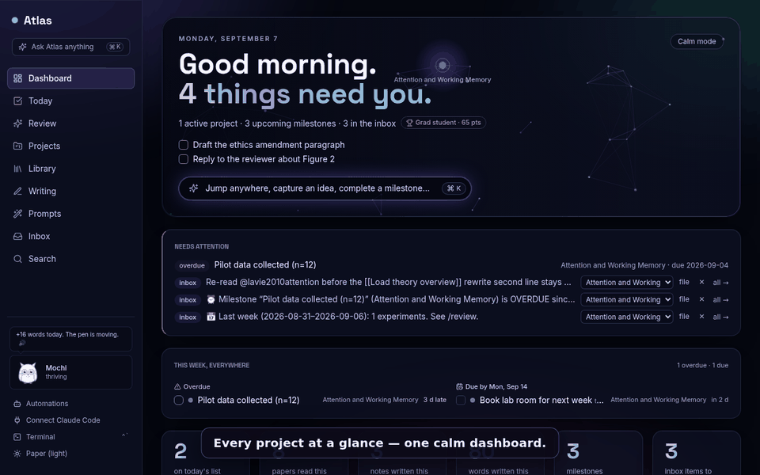

<sup>The tour is scripted — `make demo-gif` re-shoots it against the seeded demo (`scripts/demo_gif.py`).</sup>

## No installer? Run it from source in two commands

The desktop app is a shell around the same server; when a build is not available (or an
installed one misbehaves) run that server yourself — SQLite, no Docker, no Node:

```bash
uv sync                # once; needs Python 3.12+ and uv (https://docs.astral.sh/uv/)
make standalone        # → http://127.0.0.1:8000  · login atlas / atlas
```

On Windows PowerShell the second line is:

```powershell
$env:DJANGO_SETTINGS_MODULE = "config.settings.desktop"; uv run python manage.py run_desktop
```

Data lives in `~/.atlas` (set `ATLAS_DATA_DIR` to use the desktop app's folder instead, e.g.
`%APPDATA%\com.atlas.research` on Windows, so both see the same projects). `ATLAS_PORT`
picks another port. Claude Code connects to this server exactly as to the desktop one — see
*Claude / MCP* below; the API key is `ATLAS_API_KEY` if you set it, else the one written to
`<data dir>/api_key`.

## Screens

| | |
|---|---|
| 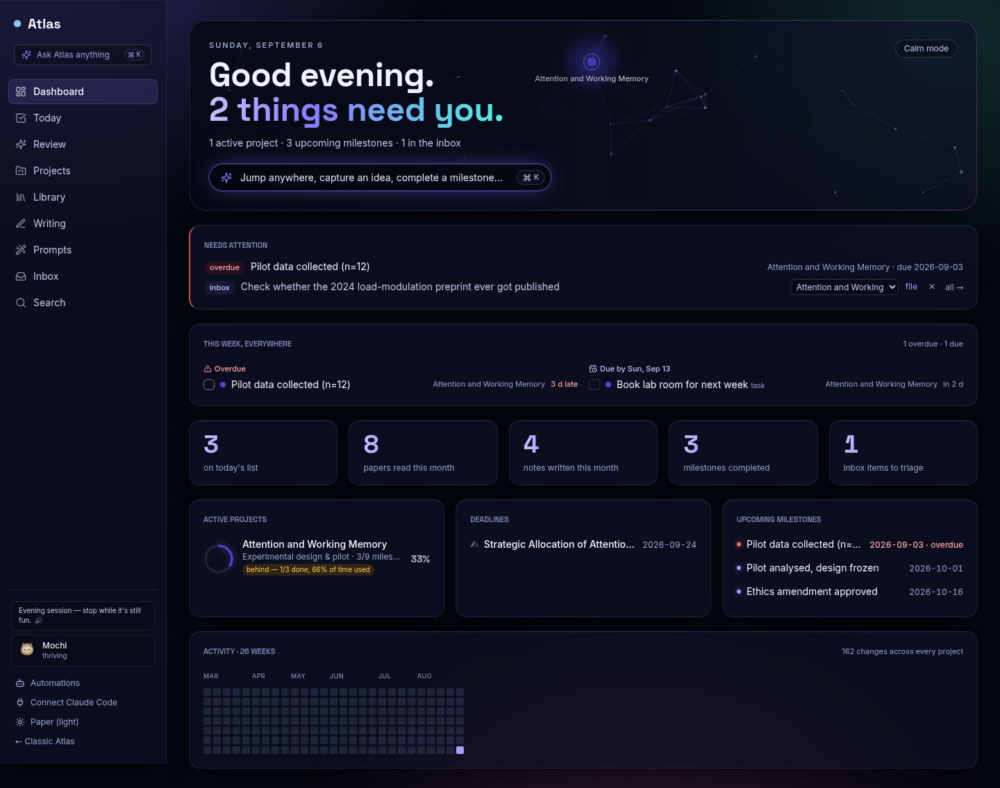 | 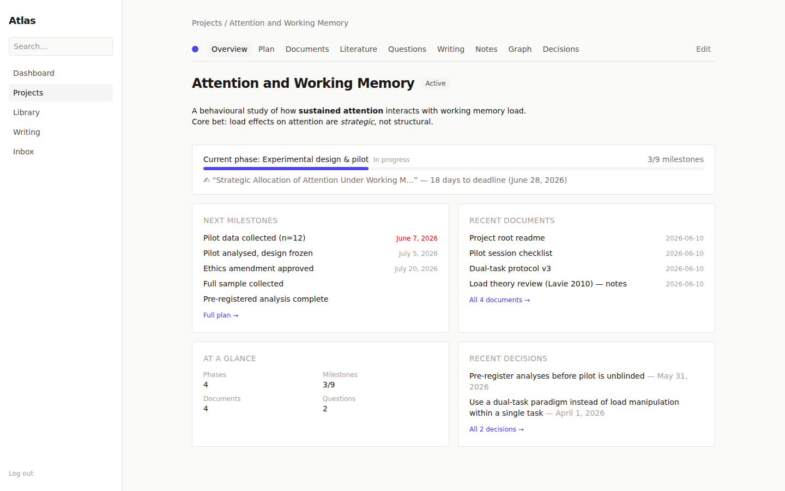 |
| *Dashboard: what needs you, this week everywhere, projects with phase health, activity* | *Project overview: current phase with health, this week, what changed, open questions, manuscripts* |
| 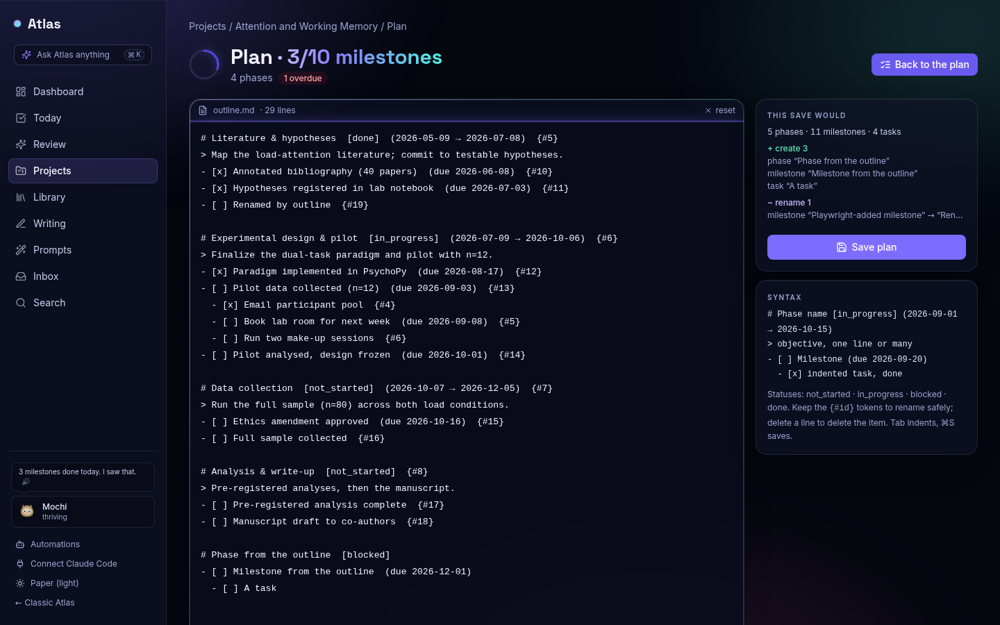 | 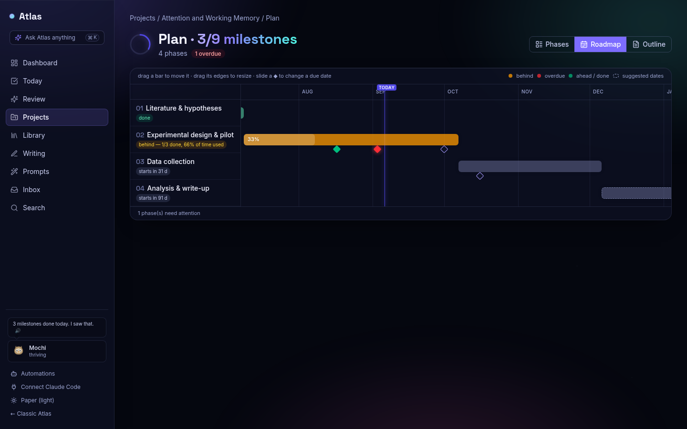 |
| *Write the plan as a Markdown outline — the preview says what a save creates, renames, deletes* | *Roadmap: drag phases and milestones on a time axis; each phase rated behind / on track / ahead* |
| 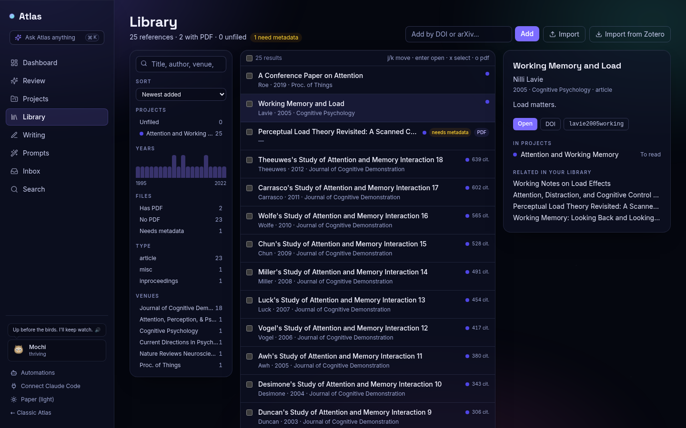 |  |
| *Library: drop PDFs / BibTeX / RIS or pull Zotero, facet, bulk-file, recover metadata* | *Read in place: highlights save as structured rows and paint back onto the page* |
| 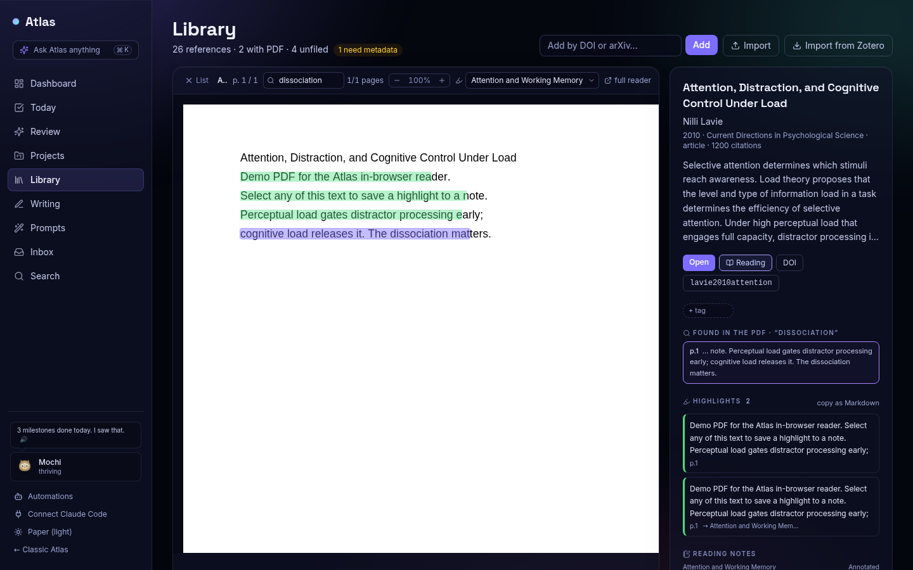 | 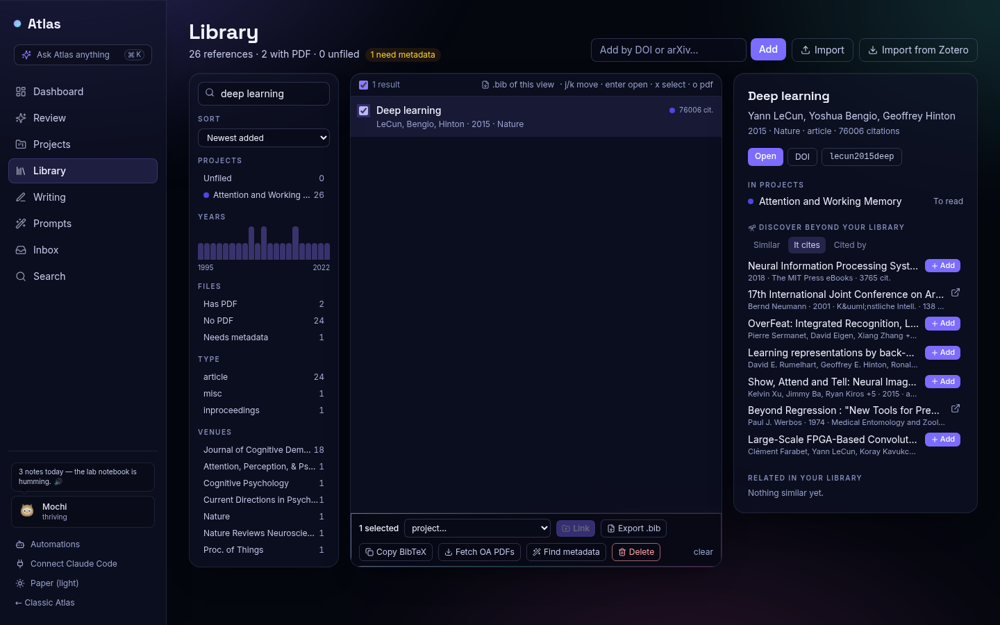 |
| *Search inside every attached PDF — the hit names the page, the reader jumps to it* | *Discover: similar / cites / cited-by on OpenAlex, one-click add into a project* |
| 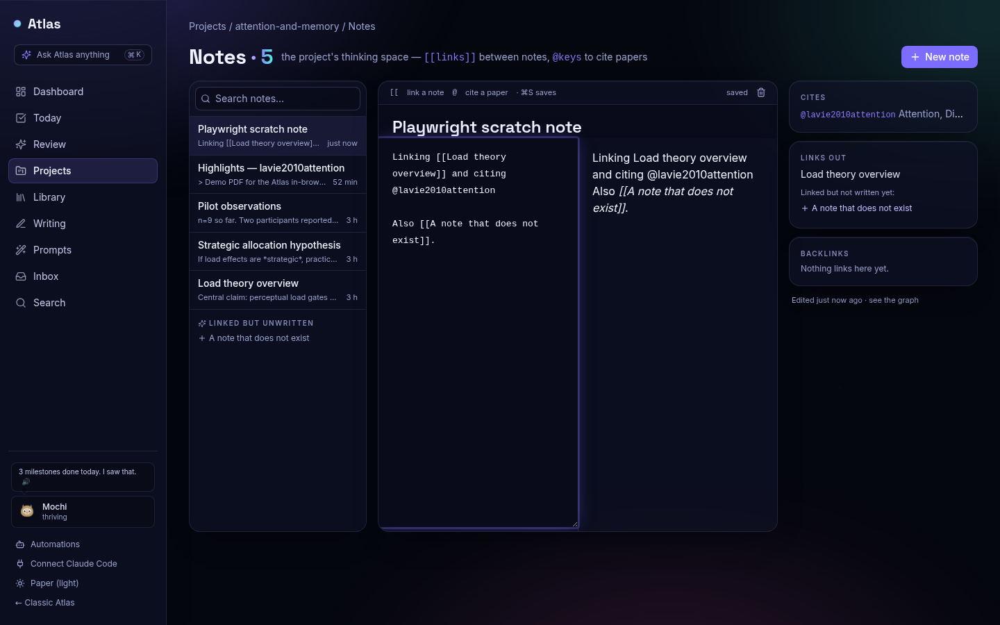 | 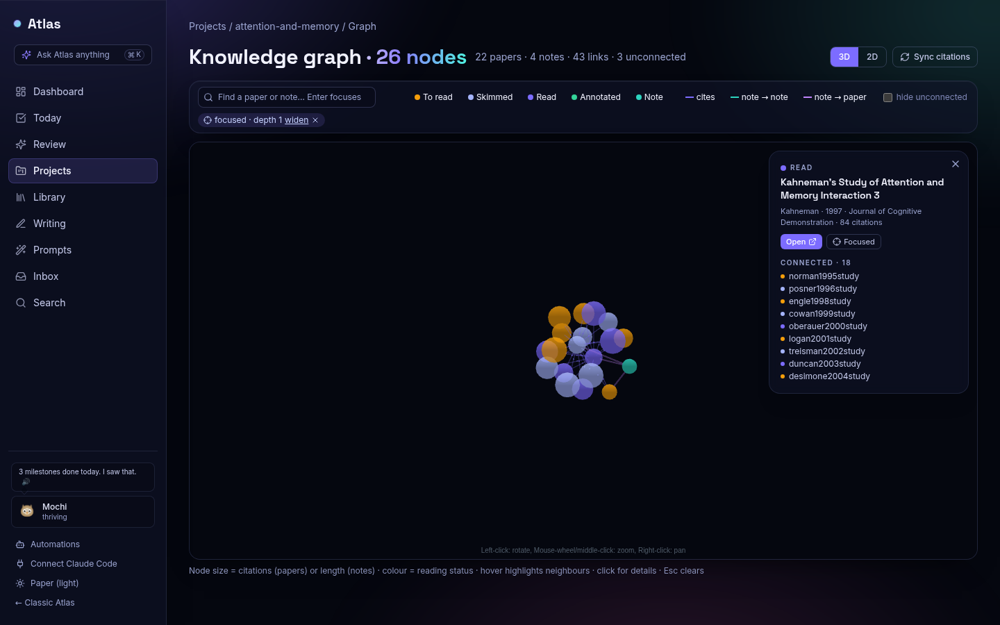 |
| *Notes: `[[links]]` and `@citations` autocomplete, live preview, link panel* | *Knowledge graph: search-to-focus, neighbourhood mode, hubs; works offline* |
| 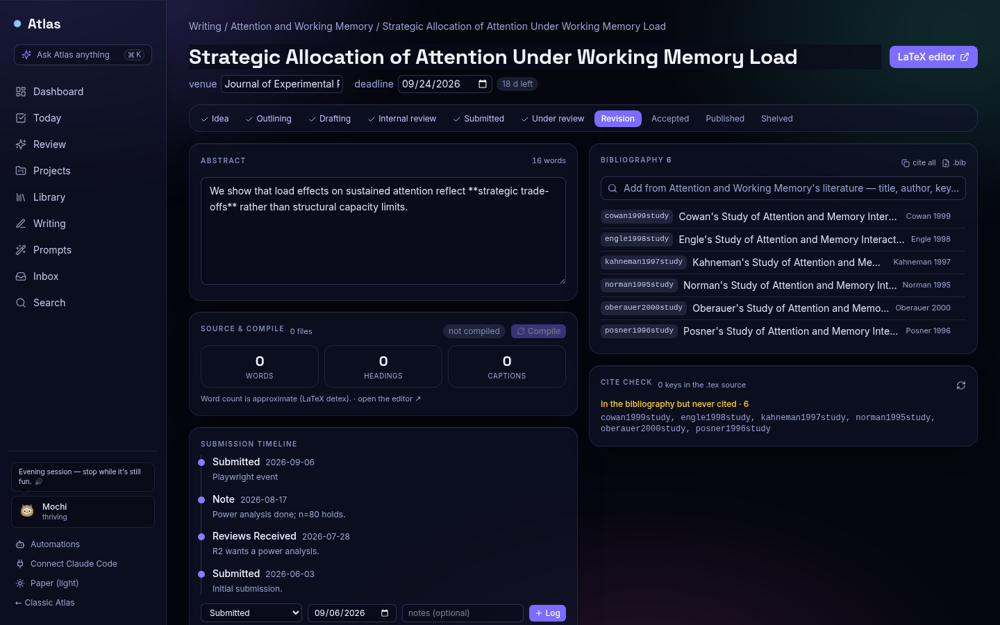 | 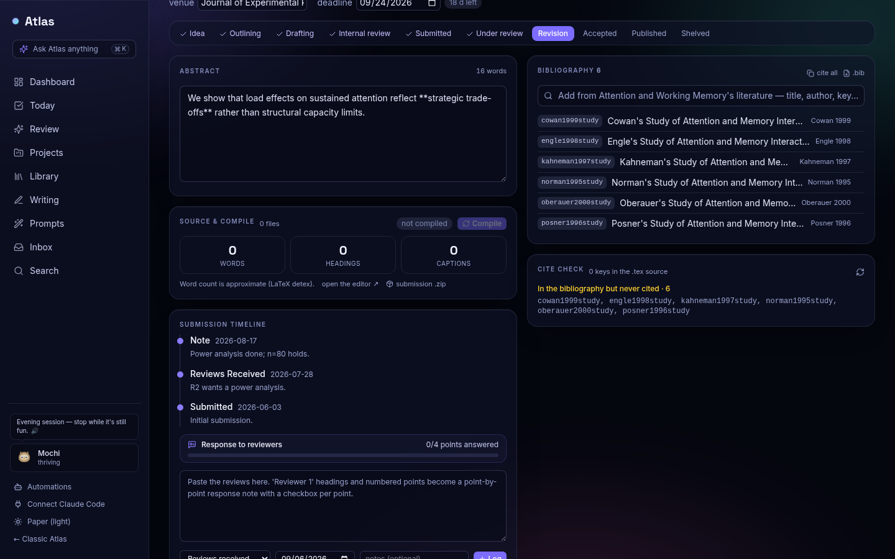 |
| *Manuscript studio: pipeline, bibliography from your literature, cite check, compile, budget* | *Paste the reviews — get a point-by-point response note and a progress bar* |
| 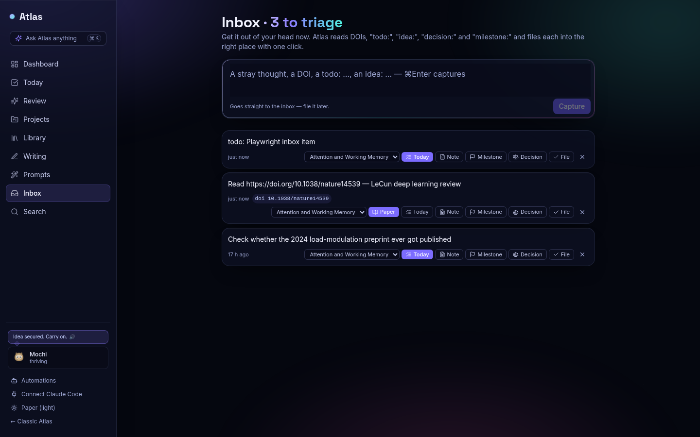 | 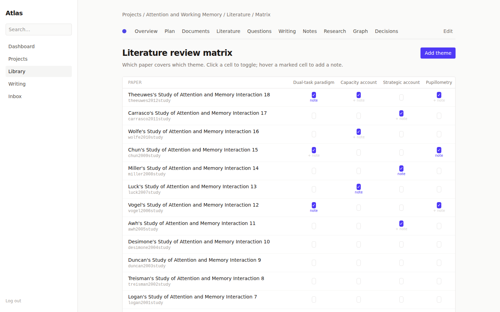 |
| *Inbox: a DOI becomes a paper, "todo:" a Today item, "decision:" a decision — one click* | *Review matrix: papers × themes, the finding typed into each cell, coverage per theme* |

## What's inside

**Projects** — one home per research effort: plan, library, notes, writing, decisions. Already have
them as folders? **Import the whole folder** (Projects → Import a folder…, `manage.py import_projects`,
the `import_projects_folder` MCP tool or the `/atlas-import-projects` skill): every subfolder becomes a
project — README → description, Markdown → notes, PDFs → the library, everything else → files in the
same structure; preview first, re-run any time, nothing on disk moves.

**Plan** — phases → milestones → optional tasks, progress rolling up visually.
- Write the whole plan as a Markdown outline (`# phase [status] (start → end)`, `- [ ] milestone (due …)`, indented tasks) with a live dry-run of what a save creates, renames and deletes; Claude edits the same outline.
- Roadmap: phases as bars (windows inferred when undated), milestones as diamonds, drag or use the keyboard to reschedule; per-phase health (behind / on track / ahead / overdue) and a finish forecast from your pace.
- "This week" strip, milestone drawer (notes, due date, tasks), phase objectives and research questions in place.
- Rearrange by hand: drag a phase by its number onto another card to reorder, drag a milestone row onto a different phase to move it there (`POST /api/v1/projects/{slug}/phases/reorder/`).

**Library** — add by DOI / arXiv; drop a folder of PDFs (the DOI is read off page one), BibTeX, RIS, CSL-JSON, or pull Zotero; everything deduplicated. Or **watch a folder**: point the Library at your Downloads folder and every PDF saved there is imported on its own (Library rail › Watch folder). Tag papers from the detail pane; right-click a tag in the rail to give it a colour, rename or delete it — the colour follows the tag onto every row. Every filtered view has an address (`/library?author=Lavie&reading_status=to_read`) — the address bar follows the rail, **Copy link** puts it on the clipboard, and a link from a note, the brief or Claude opens exactly that view. A **retraction watch** checks every DOI against Crossref's retraction notices nightly and flags a retracted paper in rose wherever it appears — the Library, the paper's page, and the manuscript pre-flight (which fails on it); the same check keeps the softer notices — an expression of concern, a correction — as an amber "see notice" mark with the notice's DOI (the pre-flight warns, never fails, on those). A **preprint watch** asks arXiv and Semantic Scholar whether your arXiv preprints have since been published, marks them in amber with the venue and DOI, and upgrades the reference in one click — the cite key stays, so no manuscript needs an edit. A **citation watch** asks OpenAlex weekly which new papers cite the papers you hold and keeps them as a feed in the Library — each row says which of your papers it cites, with Add (by DOI) and Dismiss — the Scholar alert, without the e-mail. And **feeds**: follow an arXiv category or a journal (RSS, Atom, or the journal's home page) inside the Library — its new papers land in a Feeds list with the abstract, Add (by DOI or arXiv id, into the project) and Dismiss, fetched every six hours — the daily arXiv skim, next to the papers it feeds. Each feed carries a **mute list** — words, phrases, `author:Name` — that hides the entries you never want to see ("benchmark", "survey"); muted entries are kept, listed on request, counted, and come back the moment the term goes. A feed, the citation watch and the duplicates workbench have addresses too (`/library?feeds=1&feed=3`, `?citing=1`, `?duplicates=1`), so Claude and your notes can link straight into them. Both watches also show on the dashboard (a **Watches** block: the newest entries and citing papers, one click into the Library) and in the daily brief.
- Facets, keyboard `j/k/x/o` (shift-click or shift-x selects a range, ⌘A the whole view), bulk file / mark / tag / export, saved smart views, duplicate merge that keeps every link.
- Read and highlight without leaving the page; per-project reading notes; Find PDF walks four sources until one serves a real PDF (arXiv → Unpaywall → Semantic Scholar → OpenAlex), fills in a published paper's arXiv id on the way, and says which source answered. A nightly sweep runs the same finder over every paper without a PDF (never looked at first, then monthly), so the library fills itself; the rail says what it found.
- Search inside your PDFs: every attached PDF is read into searchable text — hits name the page.
- Discover from any paper (similar / cites / cited-by), citations in APA · MLA · Chicago · Harvard · Vancouver · IEEE, retraction and duplicate checkers.
- Review matrix: an extraction table of papers × themes — click a cell, type the finding, add themes in place, copy as Markdown, draft a synthesis note; Claude fills cells from the PDFs through MCP.

**Notes & graph** — `[[wiki-links]]` and Pandoc-style `@key` citations with autocomplete, live preview, autosave, backlinks and unlinked mentions. The same mentions work in decisions, experiment entries, protocols and captures — every markdown body renders through one resolver (`core/rendering.py`) and the API returns a rendered `*_html` companion next to the source.
- Templates: a literature note built from any paper with its highlights, a daily note seeded with this week's focus, meeting, experiment. Export any note with a formatted bibliography.
- Plan review: one button walks every open milestone as a card — overdue first — with everything Atlas knows about it (late, waiting, slack, conflict, slipped, tasks) and one key per verdict (keep, done, +1 week, move, skip); the sitting is recorded, so the plan says "reviewed 9 d ago" and turns amber when a week has passed.
- Plan drift: every due-date change is logged as it is saved, so each milestone knows when it was first planned, how often it moved and how far it slipped; the plan sums it up ("+37 d since the baseline · Pilot slipped most"), the drawer lists the moves, and the roadmap draws a dotted ghost where a moved milestone used to be.
- Slack and the critical chain: each open milestone knows how many days it can slip before it pushes something that waits for it (a chip at seven days or fewer), and the plan names the chain of dependencies that decides when it ends — heavier arrows on the roadmap, a line above the phases with its span and least slack.
- Dependencies on the roadmap: arrows from each milestone to the ones that wait for it, hollow diamonds for waiting milestones, amber for date conflicts, and hovering a diamond lights its whole chain.
- Dependency date conflicts: a milestone due on or before something it waits for is called out on the plan with a suggested date, and one click pushes every such date, blockers first.
- Milestone dependencies: a milestone can wait for others (same project, no loops); blocked ones show a lock, sort after the ones that can be done now, and free themselves when their blockers complete.
- Related notes: the notes this one is about but does not link to yet, scored by shared papers, tags, link targets and words, with the reasons spelled out and a one-click link.
- Research markdown everywhere a body is rendered: `$math$` and `$$display$$` typeset with vendored KaTeX (offline in the desktop), `- [ ]` task boxes, `> [!warning]` callouts, footnotes, `==highlights==`.
- Note outline and measure: headings as a clickable outline pane, a live words · minutes · tasks line, the same numbers over the API and MCP.
- 3D/2D knowledge graph (vendored, works offline): search-to-focus, kind and link filters, neighbourhood focus, hubs, a time-lapse that replays the graph as it was filed, a #tag filter.

**Writing** — one studio page per manuscript: status pipeline, deadline countdown, abstract, compile card with approximate word count, bibliography built from the project's literature, cite check with one-click fixes, submission timeline.
- Reviewer-response tracker: paste the reviews, get a point-by-point response note and "7/12 answered".
- Venue budget: words, abstract, figures, tables, references, pages — live bars against the venue's limits.
- A full-window LaTeX studio: files, outline, bibliography and history panels, CodeMirror with `\cite{}` completion from your library and a live cite-check, PDF preview, problems panel, autosave, Vim keymap, ⌘P quick open. Compiles with Tectonic (bundled in the desktop app), keeps revisions, exports an arXiv-ready `.zip`. SyncTeX both ways: ⌘⇧J shows the cursor's line in the PDF (or let the PDF follow the cursor, an editor setting), and a double-click in the PDF opens the source line.

**Overview, dashboard, inbox, today**
- Project overview: current phase with health, this week, a digest of what changed, open questions, manuscripts at a glance.
- Dashboard: needs-attention lead, "this week, everywhere" (completable in place), phase health per project, monthly stats, 26-week heatmap.
- Inbox: capture from anywhere (⌘K, the page, Claude); smart triage turns a DOI into a paper, "todo:" into a Today item, "idea:" into a note, "milestone:" and "decision:" into the real thing.
- ⌘K makes things too: `todo:` a task (with “at 3pm”), `paper:` a DOI or arXiv id (a bare id works as well — it lands in the project you are in), `capture:` a thought, `done:` a milestone, plus “New note”, “New manuscript”, “New project”, “Add a paper”.
- Today: a dead-simple personal list for the day; “call Sam at 3pm” puts a time on it, the sidebar nudges when it comes close, and what you carried over from earlier days is counted. “review the draft on Friday” (or `s` on any row) parks it in **Later**, grouped by day, until that morning; “prep the agenda every Monday” repeats — ticking it puts next Monday's in Later. Delete, tick or snooze the wrong row and `z` (or the toast) takes it back; a deleted row waits thirty days in a **Trash** at the bottom of the page (restore it as it was, or delete it for good), so the undo survives a reload. Today's ticks stay in view; earlier days fold into a Logbook that keeps every tick, fifty at a time (“Show older”). Research tools: a hypothesis ledger (evidence from papers, notes or documents; the balance suggests a status), experiment log, datasets, decision log, protocols. Automations: deadline reminders, retraction watch, citation sync. Subscribe to milestones and manuscript deadlines from your calendar app (`/api/v1/calendar.ics`). Local extras: Piper read-aloud, extractive tl;dr — offline. Works on a touch screen: chips drop under the text, the day menu stays in its row, and the row controls are always visible where there is no hover.
- Files keep their history: replace a data file with a newer export (with a note), edit it in place, or let Claude write it, and the earlier version stays in the file's History panel to download or restore; a same-name upload asks Replace or Keep both instead of making a duplicate.
- Sort the explorer by name, last change or size, see when a file was added and last changed (in the pane, on hover, and per row under the last-change sort), and jump to the last six files you touched from a Recent strip; `list_project_files` rows carry `created_at` and `modified_at`.
- Select many files in the explorer (checkbox, shift-click, ⌘A) and download them as one zip, move them to a folder, tag them or delete them in one go; any folder downloads as a zip from its menu. Scripts get the same through `POST /api/v1/projects/{slug}/documents/bulk/` and `GET /api/v1/projects/{slug}/archive/?ids=|folder=`.
- Compare any earlier version with the file as it is now, in place: a coloured line diff for text, and for a `.csv` / `.tsv` the changed cells (row, column, then → now) with rows aligned by content and columns by header; `GET /api/v1/documents/{id}/versions/{n}/diff/` and `read_project_file(id, version=n, diff=True)` give scripts and Claude the same comparison.
- Deleting a file removes its bytes and its versions' bytes from disk; `manage.py prune_media` (dry run; `--apply`) sweeps document files no row references.
- Prompts chain: a prompt can name the one that comes next (summarize → find the gap → critique); after a copy the card offers **Next →** with the paper you picked already filled into the next step, and a loop is refused. Claude follows `next` from `get_prompt`.
- Every copy is remembered: a card says what it was last used with ("Theeuwes… · NeurIPS"), its History panel lists the last 50 copies, and **Use again** refills the card from any of them; Claude reads the same history with `get_prompt(id, history=True)`.
- Start from the object, not the prompt: a paper's menu (Library row, Library pane or Reference page), a manuscript's menu or the Studio palette, the note editor and the project overview's menu offer **Use a prompt with this…** — the gallery opens showing only the prompts that take that kind, the object already filled in, one click from Copy. Claude asks the same with `list_prompts(kind="reference")`.
- The gallery knows which prompts you reach for: every copy (yours in the gallery, Claude's over `get_prompt`) counts, a card says "used 12×", and a **Recent** strip at the top holds the last five you copied.
- Prompts can be filled from Atlas itself: `{{paper:reference}}`, `{{x:note}}`, `{{x:project}}` or `{{x:manuscript}}` draws a picker in the gallery, and Copy pastes the prompt with that paper's title, authors, venue and abstract (or the note's / project's / manuscript's text) in place — `{{name}}` and `{{name|default}}` stay free-text; Claude does the same through `get_prompt(prompt_id, values)`.
- Every file previews by what it is: a file that arrives without a type (the classic upload form, an import) is typed from its name on save, so text, tables and images open inline and draw the right icon.
- The explorer's selection behaves like a Finder selection: drag a checked row and every checked file moves with it (one request), an unchecked row moves alone; Duplicate (menu, bar, ⌘D) puts a numbered copy next to the original with its description and tags and a fresh history, and the copies become the selection. `POST /api/v1/projects/{slug}/documents/bulk/` takes `move | tag | untag | duplicate | delete`; Claude does the same by tree path with `organize_files(project, paths, action, folder, tag)`. Press `?` for the Files shortcuts.
- Files carry tags and a description in the explorer: coloured chips and a one-line description in the detail pane, editable there (a new tag gets a colour from its name), one dot per tag on tree rows, a filter row of the tags in use that narrows the tree, and ⌘P matches tag names; `GET /api/v1/documents/?tag=` (repeat it for files that must carry every tag) and `list_project_files(project, tag)` do the same for scripts and Claude. Tags are managed where they are used: right-click a chip in the filter row (or its ⋯ when active) to rename, recolour, merge into another tag or delete it (the confirm names how many files it is on); a rename into an existing name offers the merge; two chips together narrow the tree to the files carrying both. `PATCH /api/v1/tags/{id}/`, `POST /api/v1/tags/{id}/merge/` and `manage_file_tag(project, tag, rename|color|merge_into|delete)` are the same verbs for scripts and Claude.
- Phone width: below 640 px the sidebar becomes a drawer behind a top bar (menu, wordmark, ⌘K), so every page is usable in a phone's browser; nothing changes at 640 px and up.

**Claude / MCP** — 158 tools over the REST API plus five skills; your AI assistant operates the same contract you do. Only the 25-tool **core** set is loaded by default — Claude enables a toolset (`plan`, `library`, `notes`, `writing`, `studio`, `inbox`, `research`, `files`, `ops`) the moment a task needs it, so the tool list stays short and the right tool gets picked. **Mochi** 🦉 — a living companion (it watches your cursor, hops when you finish things, grows from egg to sage) fed only by finished research; it never nags. **Achievements** — ninety-odd of them in four tiers (fun, steady, hard, and a *souls* tier: "You died", "Git gud", "Boss slain: Reviewer 2"), all read from real work, with a Souls mode that tells the same facts grimly.

## Quick start (one command)

With just Docker installed:

```bash
git clone <repo-url> atlas && cd atlas
cp .env.example .env                       # set SECRET_KEY, ATLAS_API_KEY, DEBUG=false
docker compose --profile app up -d --build
docker compose exec web .venv/bin/python manage.py createsuperuser
```

Atlas is on http://127.0.0.1:8000 — the React app is the front door (the classic
server-rendered UI remains at /classic/ and trailing-slash URLs); web app, background
worker, Postgres, and Redis all running.

## Quick start (development)

Prerequisites: Python 3.12+, [uv](https://docs.astral.sh/uv/), Docker with Compose, `make`, `curl`.

```bash
git clone <repo-url> atlas && cd atlas

cp .env.example .env          # edit SECRET_KEY / ATLAS_API_KEY if you like
uv venv --python 3.12 && uv sync

docker compose up -d          # Postgres 16 (5432) + Redis 7 (6379)
make css                      # downloads the Tailwind standalone CLI on first run
make tectonic                 # LaTeX engine for the studio's Recompile (desktop builds bundle it)

.venv/bin/python manage.py migrate
.venv/bin/python manage.py createsuperuser   # you are the single user
.venv/bin/python manage.py seed_demo         # optional demo data
.venv/bin/python manage.py download_tts_voice  # optional: ~60 MB local voice for Read aloud
.venv/bin/python manage.py runserver
.venv/bin/python manage.py run_huey   # background worker (citation sync, bots), separate terminal
```

Open http://127.0.0.1:8000/ and log in. The Django admin lives at `/admin/`.

**React islands (optional, for island development only).** `make js` rebuilds the islands
in `frontend/` (Vite + TypeScript, Node 20+ required). Built artifacts are committed under
`static/js/islands/`, so running Atlas never needs Node.

## API

Everything in the UI is also available under `/api/v1/` (interactive docs at `/api/docs/`).
Authenticate with the `X-API-Key` header, checked against `ATLAS_API_KEY` in your `.env`.
Lists come 50 to a page; `?page_size=` asks for more, up to 500:

```bash
curl -H "X-API-Key: $ATLAS_API_KEY" http://127.0.0.1:8000/api/v1/projects/

# rotate the key any time (updates .env; restart the server afterwards)
.venv/bin/python manage.py rotate_api_key

# add a reference by DOI and link it to a project
curl -H "X-API-Key: $ATLAS_API_KEY" -H "Content-Type: application/json" \
     -d '{"doi": "10.1038/nature12373", "project": "my-project"}' \
     http://127.0.0.1:8000/api/v1/references/by-doi/

# preview what a folder of existing projects would become (dry run), then import one folder
curl -H "X-API-Key: $ATLAS_API_KEY" -H "Content-Type: application/json" \
     -d '{"path": "~/Projects"}' http://127.0.0.1:8000/api/v1/projects/import-folder/
curl -H "X-API-Key: $ATLAS_API_KEY" -H "Content-Type: application/json" \
     -d '{"path": "~/Projects", "dry_run": false, "only": ["attention-2019"]}' \
     http://127.0.0.1:8000/api/v1/projects/import-folder/
```

## Claude integration (MCP)

`mcp_server/` exposes Atlas as MCP tools — a thin HTTP client over the API (no Django imports),
so anything Claude can do, you can also do with curl.

**The easy way:** open **Connect Claude Code** in the sidebar (`/connect`). It shows
the exact `claude mcp add` line for *your* install, with a Copy button — paste it in a terminal
once and you're done. Then `claude mcp list` shows `atlas` as connected.
The page also lists the toolsets and which one is on by default.
**Test the connection** on that page runs four checks server-side — API key, the API answering
with it, the exact MCP command starting and reaching the API (`atlas-mcp --check` /
`python -m mcp_server.server --check`), and the `claude` CLI on PATH — each with its fix.

**Skills.** The same page installs five Atlas playbooks into `~/.claude/skills/` so Claude Code
knows the workflows, not just the tools: `/atlas-daily` (dashboard → today's three things →
inbox triage), `/atlas-literature` (DOI in, reading queue, highlights, review matrix, synthesis
note), `/atlas-writing` (files, bibliography, cite check, compile, reviews → response note,
submission events), `/atlas-plan` (outline round-trips with `dry_run`, roadmap health,
decisions) and `/atlas-import-projects` (a folder of existing projects → Atlas projects, preview
first, one folder per call). They live in `mcp_server/skills/` and a test pins every tool they mention to a real
MCP tool.

- **Desktop app:** the installer ships the MCP server as `atlas-mcp`, and the app mints its own
  API key on first launch. `atlas-mcp` finds the running app's URL and key by itself (from the
  data folder's `server.json` + `api_key`), so the line carries no secrets:
  `claude mcp add atlas -- "<install dir>/atlas-mcp/atlas-mcp"` (`.exe` on Windows).
- **Dev / server install:** the line passes the URL and key explicitly:

```bash
claude mcp add atlas \
  --env ATLAS_API_URL=http://127.0.0.1:8000 \
  --env ATLAS_API_KEY=<your key from .env> \
  -- /path/to/atlas/.venv/bin/python -m mcp_server.server
```

**Toolsets.** 158 tools is more than any one conversation needs, and a long tool list costs
Claude context on every turn. So the server loads only **core** by default — 25 tools for a
normal day (projects and plan, check-off, dashboard and brief, search, capture and inbox,
to-dos, papers and the reading queue, notes, manuscripts, diagnostics) plus `list_toolsets` and
`enable_toolset`. Everything else sits in nine named toolsets — `plan`, `library`, `notes`,
`writing`, `studio`, `inbox`, `research`, `files`, `ops` — and Claude loads one mid-conversation
with `enable_toolset("studio")`; the server announces `tools/list_changed`, so a client that
honours it (Claude Code does) sees the new tools at once. The server's instructions tell Claude
this, and each skill names the toolset it needs. Every tool description opens with what the
tool is for and stays short (a test pins the budget), so the picker reads the point first. To start with more loaded, add
`--env ATLAS_MCP_TOOLSETS=core,library` (or `all` for the whole list) to the line above; the
Connect page shows what is on by default.

Tools — projects & plans: `get_dashboard`, `get_daily_brief`, `get_day_activity`, `get_diagnostics`, `take_snapshot`, `get_backup_destination`, `set_backup_destination`, `get_achievements`, `list_projects`, `get_project_overview`, `get_status_update`, `get_plan`,
`complete_milestone`, `move_milestone`, `set_milestone_dependencies`, `fix_plan_conflicts`, `get_plan_drift`, `get_plan_calibration`, `get_plan_review`, `finish_plan_review`, `get_timeline`, `create_project`, `import_projects_folder`, `list_project_templates`, `get_plan_outline`, `set_plan_outline`, `get_roadmap`, `set_phase_dates`, `get_phase_report`, `close_phase`, `get_week_focus`.
Documents & files: `list_project_files`, `read_project_file`,
`write_project_file`, `manage_file_tag`, `organize_files`. Literature: `add_reference_by_doi`, `get_reading_queue`,
`set_reading_status`, `browse_library`, `check_retractions`, `check_preprints`, `upgrade_preprint`, `get_new_citations`, `check_citations`, `dismiss_citations`, `list_feeds`, `add_feed`, `update_feed`, `remove_feed`, `refresh_feeds`, `get_feed_items`, `add_feed_item`, `dismiss_feed_items`, `get_reading_progress`, `set_reading_position`, `run_bib_check`, `get_review_matrix`, `set_review_mark`, `add_review_theme`, `suggest_review_themes`, `get_synthesis_scaffold`.
Library imports & discovery: `import_references` (BibTeX/CSL-JSON/RIS text), `import_from_zotero`,
`discover_related` (similar / cites / cited-by on OpenAlex), `export_references` (bib / ris / csl / csv), `format_citations` (APA/MLA/Chicago/Harvard/Vancouver/IEEE).
Tags, views & hygiene: `list_library_tags`, `tag_references`, `find_duplicates`, `merge_references`.
Reading: `list_highlights`, `add_highlight`, `get_highlights_markdown`, `get_reading_notes`, `set_reading_notes`, `fetch_pdf`, `search_pdf_text`, `search_in_pdf`, `get_reference_tldr`, `get_reference_usage` (where a paper appears: notes, decisions, entries, manuscripts, evidence), `get_related_in_library` (the library's most similar papers, computed locally).
Writing progress: `get_writing_progress` (words per day, today's delta, streak, best day). Style lint: `lint_manuscript` (the mistakes a compile never reports — unescaped %, \label before \caption, undefined/duplicate labels, spaces before \ref and units, straight quotes, $$, \\ in prose, unmatched environments, unbalanced braces — each with file:line and a suggested fix), `fix_lint` (apply the mechanical ones — all, or a chosen subset). Find in project: `search_manuscript` (every match across the .tex/.bib files — plain or regex, file:line:col with the line), `replace_in_manuscript` (replace across files, or only some, saved like an editor save). Status clock: every manuscript carries `clock` ("42 d under review", since which event) and `clock.nudge` (whether a polite note to the editor is fair yet — 1.5× your own median at the venue, or 90 days without history; a logged note mentioning "nudge" restarts the count); `get_venue_turnaround` (your own median days from submission to decision at a venue, first-decision median, rounds). Figure audit: `audit_figures` (every \includegraphics with format, pixels, printed width, effective dpi and size — 300 dpi is the bar, vector passes). Submission readiness: `submit_manuscript` (submit through the pre-flight — refused with the report while a check blocks, `force` to override; logs the event with the readiness note), `preflight_manuscript` (every check from real data — compiled PDF fresh, errors, undefined references, cite keys, bibliography hygiene, venue limits, figure files, leftover markers, .bbl, metadata).
From the matrix to the paper: `draft_related_work` (a `Related work` .tex section from the review matrix, every key in the bibliography).
Toolsets: `list_toolsets`, `enable_toolset`. Automations: `list_bots`, `run_bot`, `toggle_bot` (the bots report to the Inbox).
Today list: `list_todos` (`when="trash"` for the Trash), `add_todo`, `complete_todo`, `snooze_todo`, `reorder_todos`, `trash_todo` (into the Trash, back from it, or gone for good).
Notes, search & review: `add_note`, `list_notes`, `list_note_tags`, `get_note`, `update_note`, `get_note_links`, `get_note_outline`, `get_related_notes`, `get_project_graph`, `get_note_graph`, `list_note_revisions`, `get_note_revision`, `restore_note_revision`, `link_mentions`, `create_note_from_template`, `export_note`, `quick_capture`, `list_inbox`, `enrich_capture`, `triage_captures`, `get_inbox_history`, `snooze_capture`, `convert_capture`, `search`, `get_weekly_review`,
`list_prompts`, `get_prompt`. Manuscripts (LaTeX): `list_manuscripts`, `get_manuscript`,
`list_manuscript_files`, `read_manuscript_file`, `write_manuscript_file`, `attach_manuscript_figure` (a local PNG/PDF into the source tree, with the `\includegraphics` snippet back), `set_main_file`, `duplicate_manuscript` (a fresh paper from an existing one — sources, assets, limits, bibliography),
`compile_manuscript`, `get_compile_status` (its `diagnostics` list), `compile_and_wait`,
`latex_word_count`. Protocols: `list_protocols`, `add_protocol`, `new_protocol_version`. Research: `add_hypothesis`, `set_hypothesis_status`, `add_evidence`, `log_experiment`. Bibliography & submissions: `get_manuscript_bibliography`, `add_manuscript_reference`, `remove_manuscript_reference`, `manuscript_cite_check`, `add_submission_event`, `log_reviews`, `get_response_progress`, `get_manuscript_budget`, `set_venue_limits`.

Smoke-test conversation script (after `seed_demo`):

1. *"List my projects"* → expect Attention and Working Memory.
2. *"What should I work on in attention-and-memory?"* → overview with current phase + overdue pilot milestone.
3. *"Check off the 'Pilot data collected' milestone"* → get_plan for the id, then complete_milestone; progress moves 3/9 → 4/9.
4. *"Add 10.1038/nature12373 to that project"* → add_reference_by_doi; appears in the reading queue.
5. *"Capture: email co-author about revisions"* → quick_capture; visible in the Inbox.

## File workspace, desktop app & terminal

Every project has a **Files** page (in the SPA subnav): one unified tree holding your
documents *and* your manuscript/LaTeX sources together, kept live. Click any file to open
it in-app — text/code/Markdown in a viewer, PDFs via the (locally vendored) pdf.js, CSVs
as a table, images inline. You can edit text in place, create folders, rename, delete,
drag-drop to upload, move files between folders, and jump to any file with **Ctrl/Cmd-P**.
**Right-click anything** (or press the ⋯ on a row) for its actions — rename, delete, download,
new folder inside, upload here; F2 renames and Del deletes the focused row. The same ⋯ menus
appear on projects, decisions, figures, prompts, papers, hypotheses, experiments, datasets,
questions, phases and manuscripts: everything you can see, you can edit and delete in place.
It is machine-friendly too: `list_project_files`, `read_project_file`, `write_project_file`,
`create_project`, and `list_project_templates` are MCP tools.

**Project templates** scaffold an organized layout on creation — pick *Empirical study*,
*Theory / review paper*, *Software / dataset project*, or *Minimal* (literature/, data/,
analysis/, manuscript/, notes/ ...), or **save any project's structure as your own template**. Since #438 a template is also a first **plan** (phases → milestones → tasks, with objectives), a couple of starter **research questions** and the **review-matrix themes** that fit the kind of project — laid down only where the project has none yet, and all editable afterwards.

### Desktop app (Tauri)

Atlas also ships as a **self-contained desktop app**: one installer for Linux (`.deb`/`.rpm`)
or Windows (`.exe`/`.msi`) that bundles the Django server frozen with PyInstaller, running on a
per-user SQLite file — no Python, Postgres, Redis, or Docker on the machine. Installers are
built by the **Desktop release** GitHub Actions workflow and attached to the "Atlas desktop
preview" release (or a `v*` tag). On top of the web app the desktop build adds a **terminal
dock** — press ⌃` on any page for a real shell (tabs, resize, maximize), with a **Claude**
button that opens Claude Code already connected to Atlas — and **Open from disk** (a native
file picker). The web app stays the single source of truth.

To hack on the shell against a running dev server:

```bash
cd desktop
cargo install tauri-cli --version "^2"   # one-time
make desktop          # dev run (Atlas must be running on :8000)
make desktop-build    # packaged binary -> desktop/target/release/bundle/
```

See `desktop/README.md` for how the bundled build works, per-OS prerequisites, and the
one-time signing setup that activates the in-app updater. The terminal and disk access are
desktop-only and are never exposed through the web API or MCP.

## Auto-update

Installed desktop apps check for a new build once per launch and show **Update to 0.1.N** in
the sidebar; one click downloads, verifies and installs it, then **Restart to finish**. The
pieces, in order:

1. Every push builds installers; when the `TAURI_SIGNING_PRIVATE_KEY` secret is set the
   workflow also produces a `.sig` per installer and a `latest.json` feed, signed with that key.
   The matching public key is baked into the app (`desktop/tauri.conf.json`), so a tampered
   feed is rejected.
2. The app fetches `latest.json` from its updater endpoints (this repository's
   `desktop-preview` release), compares versions, and offers the download. The repository is
   public, so the app reads the feed directly; the workflow's optional `mirror` job (secrets
   `RELEASES_REPO` + `RELEASES_TOKEN`) copies each build into a separate public releases
   repository only if you ever make this one private again.
3. **When it seems not to work, ask Diagnostics.** Tick *Probe the update feed* on
   `/diagnostics` (or run `manage.py doctor`): the **Update check** row fetches the feed the
   way the app does and gives one verdict — a newer build is available and signed for this
   app, up to date, the feed is signed with a different key (install that build once from the
   releases page), unsigned, unreachable, or offline. Older builds only looked at the
   old repository address, which now redirects, so they still find updates; a build older
   than the feed's signing key needs one manual install, after which updates work in-app.

`cargo tauri signer generate` makes the key pair; keep the private key only in the GitHub
secret. Rotating it means users must reinstall once, because the old public key no longer
matches.

### If the window is blank

A blank window (only the background, no sidebar) means the app script did not run to the end.
Since #382 it cannot stay silent: after a few seconds a panel says **"Atlas couldn't draw the
app"** with the errors that were thrown, a Reload button, a link to the classic pages, and the
path of the server log the report was also written to. A crash while drawing one page shows
that page's error in place with the sidebar intact. Every report lands in `atlas-server.log`
and under **Front-end errors** on `/diagnostics` — paste that section when reporting. Diagnostics also lists
the **Access** log: logins, failed logins, lockouts and rejected API keys, so you can tell
whether anyone else has tried the door. In the
desktop app **F12** (or Ctrl+Shift+I, or the *Web inspector* button on Diagnostics and on the
blank-window panel) opens the web view's own inspector, so the console is one key away. The
desktop also re-collects its static assets with `--clear` on every version change and serves
them with revalidation, so an update can never leave the previous build's scripts behind.

The calendar subscription URL on the Dashboard carries a **read-only feed token** (not the API
key); *rotate* next to it retires every URL copied so far.

## Backups

**One file.** `GET /api/v1/backup.zip` — or *Download a backup* on `/diagnostics` and the ⌘K verb —
is everything Atlas knows as one zip: a consistent copy of the database (the SQLite file itself
on the desktop, a JSON dump on a server install) plus the media folder, with restore notes
inside. Diagnostics says when the last one was and the dashboard nudges, calmly, once it is
two weeks old. **Restore** from `/diagnostics` › *Restore from a backup*: the zip is staged and
applied at the next launch, before the database opens; the previous data is kept next to it. A
server install runs `manage.py restore_backup backup.zip` while stopped.

**Automatic snapshots.** The backup you never have to remember: while the desktop app runs it
writes the same zip into `<data folder>/backups/` once every 24 hours (the first one a couple
of minutes after launch, never on an empty install) and keeps the last seven, oldest dropped.
The *Automatic snapshots* section on Diagnostics shows the folder, the newest file, how many
are kept and the last failure if one happened; *Snapshot now* writes one on demand, *Show
in folder* opens it in the file manager, and each listed snapshot has *Restore…* — the same
staged restore as an uploaded zip, applied at the next launch. The zip is written under a temporary name and renamed
when complete, so a crash mid-write never leaves a half zip that looks like a backup. A server
install gets the same from cron:

```
0 3 * * * cd /srv/atlas && uv run python manage.py snapshot --if-due
```

**A copy off the machine.** Attach a **backup destination** on Diagnostics — an external drive,
or the local folder of a sync service (Google Drive, Dropbox, OneDrive, iCloud Drive, Nextcloud,
Proton Drive…; Atlas lists the ones it finds on the machine, one click attaches one) — and every
snapshot is copied into `<destination>/Atlas backups/`: written under a temporary name, verified
byte for byte, renamed, the last fourteen kept. The sync client carries it to the cloud on its
own; Atlas never uploads anything. Diagnostics says whether the folder is reachable right now
(a drive may be unplugged), which copy is newest, whether the newest snapshot has landed, and
the last failure; *Copy newest now* catches up after a drive comes back. The same over the API
(`GET/POST /api/v1/backup-destination/`, `POST …/sync/`), MCP (`get_backup_destination`,
`set_backup_destination`) and `manage.py snapshot --to /mnt/backup` for a server install.

`ATLAS_SNAPSHOT_DIR` moves the folder (a second disk, a synced folder); `--keep N` changes the
rotation; `GET/POST /api/v1/snapshots/` reads the status and takes one.

## Atlas as a tab in another app

Atlas refuses to be framed by default (`X-Frame-Options: DENY`). To show the whole app as a tab
inside another web app — [OpenManus](https://github.com/muhammed-aksoy/OpenManus), a lab portal,
a personal dashboard — name the origins that may:

```
ATLAS_FRAME_ANCESTORS=http://localhost:3000
```

Every page then answers with `Content-Security-Policy: frame-ancestors 'self' http://localhost:3000`
instead: that tab may show Atlas, any other site still may not. Whole origins only
(`scheme://host[:port]`, spaces or commas between several); anything else is dropped.
Diagnostics says what is in effect ("Embeddable from"), and so do `GET /api/v1/diagnostics/`
(`frame_ancestors`) and the `get_diagnostics` MCP tool. Use the same hostname on both sides
(`localhost` in the host app's address bar and in the tab's Atlas address) so the login cookie
reaches the frame and you sign in once. The full recipe for OpenManus — a page, a route, a
sidebar button, `VITE_ATLAS_URL`, Atlas pinned to port 8001 — is in
[`docs/integrations/openmanus.md`](docs/integrations/openmanus.md).

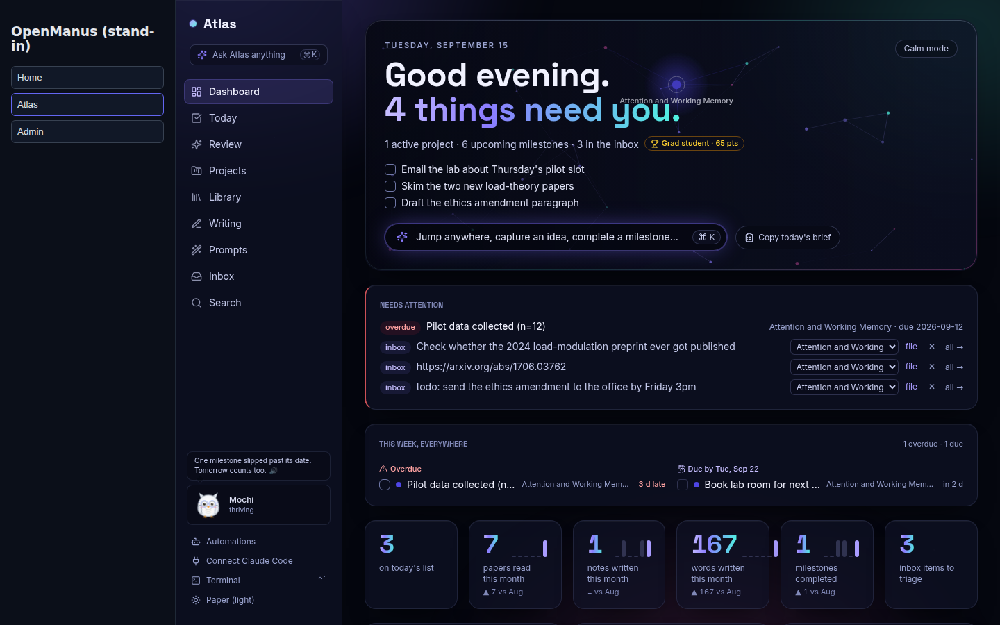

A project can also leave as a **Markdown vault** — `GET /api/v1/projects/{slug}/vault/` (or the overview menu / ⌘K "Export this project as a Markdown vault"): notes with their `[[links]]`, decisions, the plan outline, `references.bib`, research, protocols, manuscript sources and documents as a folder of files that opens in Obsidian or any editor.
